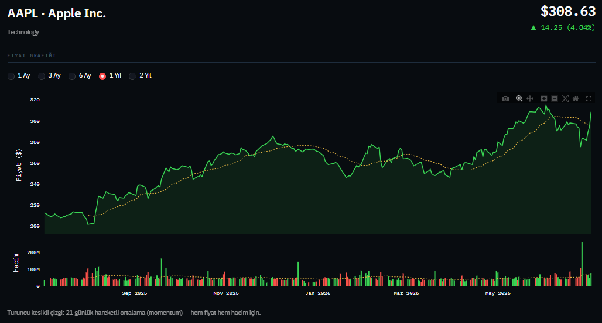
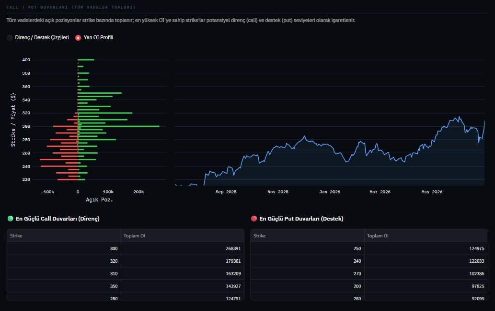
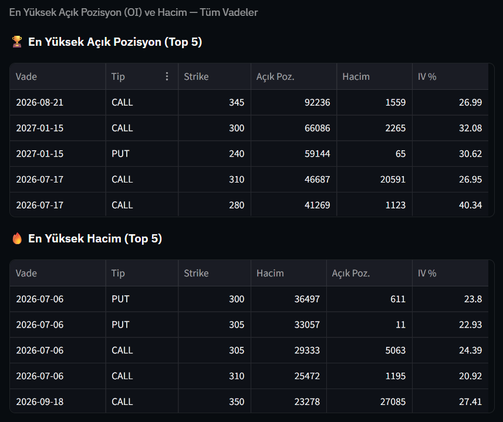

# Idea of Money — Opsiyon Analiz Terminali

**Idea of Money**, [yfinance](https://pypi.org/project/yfinance/) üzerinden gerçek zamanlı hisse
senedi ve opsiyon verisi çekip, tek ekranda profesyonel bir opsiyon analiz paneli sunan bir
Streamlit uygulamasıdır. Bir hisse sembolü yazman yeterli — teknik göstergeler, opsiyon zinciri,
piyasa hissiyatı ve max pain analizi saniyeler içinde karşına çıkar.

Yatırım kararı vermeden önce hızlıca "bu hissenin opsiyon piyasası ne söylüyor?" sorusuna cevap
aramak isteyenler için tasarlandı.

## Neler yapabiliyor?

**📊 Temel & teknik veriler**
- Fiyat, günlük değişim, hacim, piyasa değeri, F/K ve PEG oranı, 52 haftalık aralık, beta
- RSI (14) — aşırı alım / aşırı satım / nötr durumunu renkli rozetle gösterir
- SMA 20/50, EMA 20 ve Bollinger Bantları — güncel fiyata göre üstünde mi altında mı olduğunu
  yeşil/kırmızı yön okuyla işaretler

**⛓️ Opsiyon zinciri**
- Her vade tarihi ayrı bir açılır (dropdown) panel olarak listelenir
- Panel başlığında o vadenin özeti: kalan gün, put/call oranı, sentiment, max pain, toplam açık pozisyon
- Panel içinde CALL/PUT tipine ve strike fiyatına göre filtrelenebilir detaylı tablo
- Hem tüm vadeleri tek seferde hem de tek bir vadeyi ayrı ayrı **CSV olarak indirme**

**📈 Piyasa hissiyatı & görselleştirme**
- Put/Call oranı göstergesi (gauge chart) ve genel sentiment etiketi (Çok Bullish → Çok Bearish)
- Strike bazında açık pozisyon (OI) grafiği
- Zımni volatilite (IV) eğrisi
- Vadelere göre açık pozisyon dağılımı
- Call/Put hacim dağılımı (donut chart)

**⚡ Performans**
- `st.cache_data(ttl=300)` ile aynı hissenin verisi 5 dakika boyunca önbellekten gelir,
  gereksiz Yahoo Finance isteği atılmaz.

<p align="center">
  
</p>
<p align="center">
  
</p>
<p align="center">
  
</p>
<p align="center">
  
</p>

## Gereksinimler

- Python 3.9 veya üzeri
- İnternet bağlantısı (Yahoo Finance verisine erişim için)

## Kurulum ve localde çalıştırma

```bash
# 1) Projeyi klonla (veya zip olarak indirdiysen klasöre gir)
git clone https://github.com/KULLANICI_ADIN/REPO_ADIN.git
cd REPO_ADIN

# 2) Bağımlılıkları kur
pip install -r requirements.txt

# 3) Uygulamayı başlat
streamlit run app.py
```

Komut çalıştıktan sonra tarayıcında otomatik olarak `http://localhost:8501` açılır. Açılmazsa
terminalde yazan **Local URL**'e manuel olarak gidebilirsin.

Uygulamayı durdurmak için terminalde `Ctrl + C` yeterli.

### Sık karşılaşılan sorunlar

| Sorun | Çözüm |
|---|---|
| `ModuleNotFoundError` | `pip install -r requirements.txt` komutunu tekrar çalıştır, sanal ortamın aktif olduğundan emin ol |
| Veri gelmiyor / boş sonuç | Sembolü kontrol et (`AAPL` gibi ABD borsası sembolleri en stabil çalışır), birkaç saniye bekleyip tekrar dene |
| Yahoo Finance rate-limit hatası | Çok sık istek atıldığında geçici olur; ~30 saniye bekleyip tekrar dene |

## Proje yapısı

```
├── app.py              # Uygulamanın tamamı (veri çekme + arayüz)
├── requirements.txt     # Python bağımlılıkları
└── README.md            # Bu dosya
```

## Notlar

- Veriler [Yahoo Finance](https://finance.yahoo.com/) kaynaklıdır ve yatırım tavsiyesi
  niteliği taşımaz; tamamen bilgilendirme amaçlıdır.
- Yahoo Finance bazen rate-limit uygulayabilir; çok sık istek atılırsa geçici
  hatalar görülebilir, bu durumda birkaç saniye bekleyip tekrar denemek yeterli.
- Opsiyon verisi bulunmayan sembollerde (ör. bazı düşük hacimli hisseler) uygulama
  bilgilendirici bir hata mesajı gösterir.
